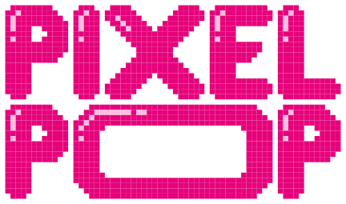

# Pixel Pop

<p align="center">
  
</p>

PixelPop is a lightweight pixel art editor built for fun, creativity, and simplicity. Designed for designers, artists, and kids of all ages, it runs right in your browser with full touch support and easy export options.

## Features

- **Drawing Tools**: Pencil, Eraser, Fill, and Selection tools
- **Effects**: Glow, custom pixel shapes, corner radius, and bulb lighting
- **Export Options**: SVG, PNG, and JPG with customizable settings
- **Multiple Renderers**: Canvas and SVG rendering engines
- **Touch Support**: Full support for touch devices with pinch-to-zoom and touch drawing
- **Figma Plugin**: Import your pixel art directly into Figma as vector objects

## Figma Plugin

PixelPop includes a Figma plugin that allows you to export your pixel art directly to Figma:

1. Create your pixel art in PixelPop
2. Click the "Copy to Clipboard" button
3. Open Figma and run the PixelPop plugin
4. Paste your pixel data and click "Process"
5. Your pixel art appears as vector objects in Figma!

See the [figma-plugin](./figma-plugin) directory for more details.

## Getting Started

```bash
# Clone the repository
git clone https://github.com/yourusername/pixel-pop.git

# Navigate to the project directory
cd pixel-pop

# Install dependencies
npm install

# Start the development server
npm run dev

# Build for production
npm run build

# Preview production build
npm run preview
```

## Documentation

Comprehensive documentation is available in the [docs](./docs) directory:

- [Overview](./docs/README.md) - General information and getting started
- [Core Architecture](./docs/architecture.md) - Component structure and state management
- [Features Guide](./docs/features.md) - Detailed description of all features
- [Implementation Details](./docs/implementation.md) - Technical details about the implementation
- [Extending PixelPop](./docs/extending.md) - Guide for adding new features
- [Troubleshooting](./docs/troubleshooting.md) - Solutions for common issues

## Testing

PixelPop includes a comprehensive test suite using Vitest and React Testing Library.

```bash
# Run tests
npm test

# Run tests in watch mode
npm run test:watch

# Run tests with coverage
npm run test:coverage
```

## Project Structure

- `src/components/`: React components
- `src/hooks/`: Custom React hooks
- `src/utils/`: Utility functions
- `src/styles/`: Global styles
- `src/test/`: Test configuration and documentation

## Technologies Used

- React for UI and state management
- Canvas and SVG for rendering
- Styled Components for styling
- React Zoom Pan Pinch for transformations

## Contributing

Contributions are welcome! Please feel free to submit a Pull Request.

## License

This project is licensed under the MIT License - see the LICENSE file for details.
